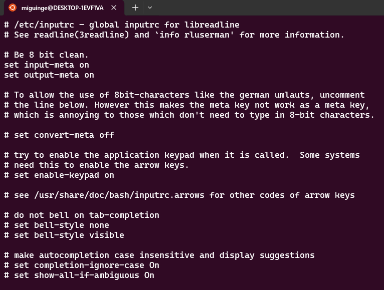
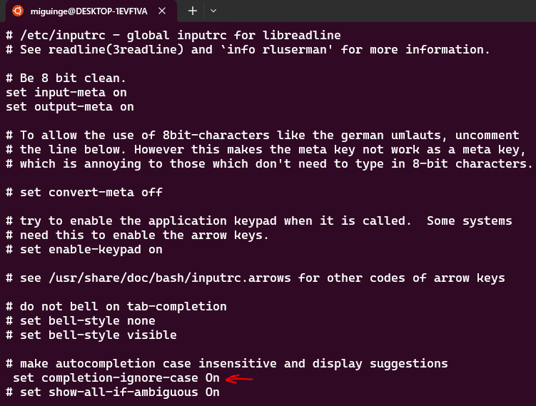

# CLI case insensitive command-autocompletion

You installed Ubuntu on WSL and are eager to play around with Linux in your windows system :wink: after a few types you found that the tab for autocompletion is case-sensitive, say, for a directory name.

## Don't worry!! :smiley:

You have to edit the file `/etc/input`

The field `set completion-ignore-case On` below the section **`# make autocompletion case insensitive and display suggestions`** is commented out.

You olny have to uncomment the line `set completion-ignore-case On`

That's it, now the CLI autocompletion is _**case-insensitive**_.
